

# Obbax's Pixel Art Helper
## Description
This is the documentation on how to use Obbax's Pixel Art Helper. This mod allows the user to pre-process an image, and then see an outline for constructing it as pixel art in Terraria. The mod is client side, so their is no need for it to be installed by all players on servers.

## How To Use It
Video Tutorial: https://youtu.be/DRQLFm2br94 \
Utilizing the mod requires two main steps, starting with the pre-processing of the image(s).

### Pre-processing

 1. Download the zip file from this repositiory and extract it.
 2. Before running the .exe file, open "exceptions.txt". This file contains the ids for walls and tiles which you may not want to use (Either because they are tedious to get or just straight up impossible). About halfway through the file should be the word "walls", which denotes the beginning of the section containing wall ids. The ids can be found here: [tiles](https://terraria.wiki.gg/wiki/Tile_IDs) and [walls](https://terraria.wiki.gg/wiki/Wall_IDs)  
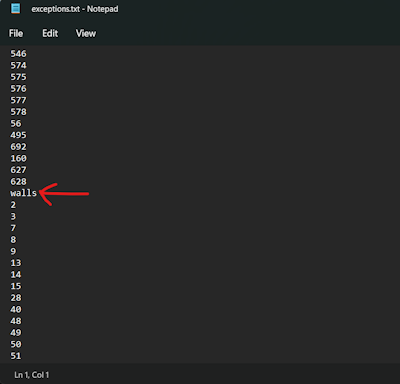
    - This process may be tedious, and can be skipped if you trust my judgement :)
 4. After setting up the exceptions, save the file and run the exe. A window should pop up, which asks for a few things. 
    - The "Alpha Cutoff" is the alpha value at which the script should ignore the pixel (from 0 to 255, recommended is 10).  
    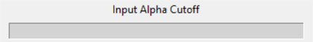
    - The "Name To Save As" is self-explanatory. The name which you want to save the file as. (It will be saved as a .txt file in the same directory as the exe, so don't name it exceptions, or else...)  
    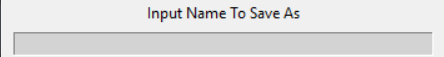
    - The "Use Paints" button is a toggle for whether or not you want the script to consider paints. I recommend not using paints if you plan to build it without the use of cheats.  
    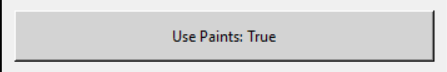
    - The "Select Image File" button will prompt you to select the image which you want to use. Generally, its probably a good idea to use an image that is smaller and does not have as many colours. Larger images will take longer to process and will be much larger in-game.  
    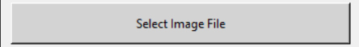
    - Finally, "Print File" will process the image and output the data to the text file. The text below will say "completed" when it is done, and the window can be closed.  
    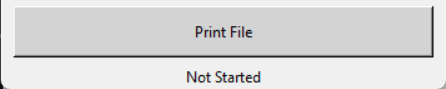
 5. After this, the images are ready to be loaded in-game.
 
### Loading Files Ingame

1. Open the mod config via the pause menu. There should be two displayed options.
   - The first field is the directory in which the outputted .txt file is located.   
   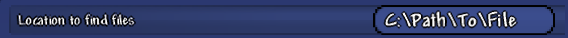
   - Tab out of Terraria and open the extracted folder in file explorer, and right-click the top bar. Then select, "copy address as text", tab back in, and paste the copied text. After doing this, you can save the config.  
   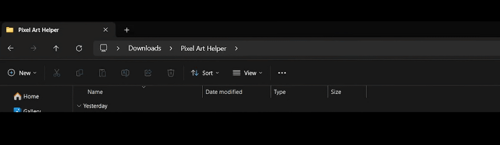
      - I.E. "C:\Users\[Name]\Downloads\Pixel Art Helper"
   - The second option is optional. It toggles a mode which will only display the pixels of the held block. This is useful for if an image requires placing many of the same block, and allows you to do it all at once.  
   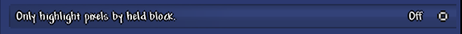
2. To show the outline on screen, place the cursor where you want the top-left of the image to be, and type "/openHolo [fileName]" in chat (Don't include the .txt). If everything has been done right up to this point, you should see the outline.  
   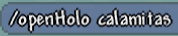   
   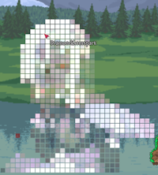
4. To close it, type "/closeHolo" in the chat.

## What's to come
In the future, I plan on adding an ingame UI which tells the user the remaining blocks which need to be placed in order to complete the pixel art. Coming maybe never.
Potentially also an easier means for doing tile exceptions, perhaps incorporated into the python UI somehow.
